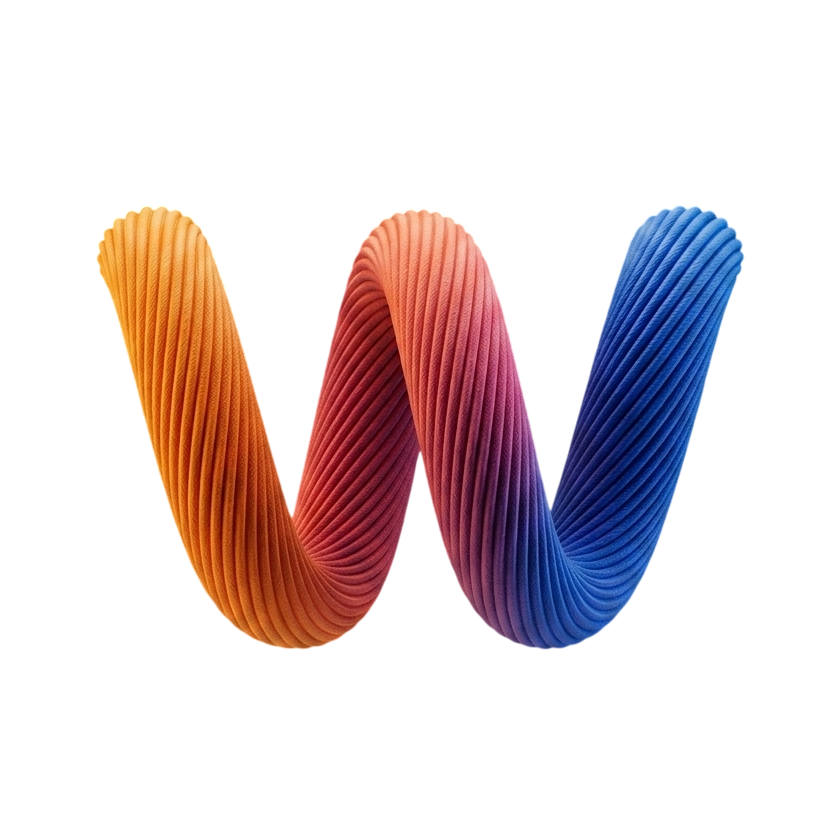

<div align="center">



# weft

**Multi-repo agent orchestration for macOS.**

Run parallel AI coding agents across many git repos at once. Every task gets isolated worktrees in every repo — each on a shared task branch — with a built-in multi-repo diff and per-repo commit flow.

[](https://github.com/viktorfroberg/weft)
[](https://tauri.app)
[](https://rustup.rs)
[](https://react.dev)
[](LICENSE)

<br>


</div>

<br>

## tl;dr

```bash
git clone https://github.com/viktorfroberg/weft
cd weft && bun install
bun run tauri dev
```

Register a repo → optionally group repos into a preset → create a task → weft fans out isolated worktrees in every repo on `weft/<slug>` (or `feature/<ticket-id>`). The default agent auto-launches with the full task context; ⌘T opens more terminal or agent tabs. Each agent sees all worktrees, writes diffs you review and commit across repos from one panel.

---

## Why

AI-assisted work increasingly spans multiple repos per task. A feature might touch an admin UI, an API, and a shared library at the same time. Existing agent tooling either locks you to one repo (losing task context) or dumps everything into one session (losing isolation).

weft organizes work by **task**, not by repo:

- **Task-scoped worktrees.** Every task gets a git worktree in every attached repo — agents and your terminal see all of them.
- **Dynamic repo membership.** `+ Add repo` attaches another worktree mid-task, `×` removes one.
- **Agent-agnostic.** Claude Code today, any CLI tomorrow. Preset templates (`{prompt}`, `{bootstrap}`, `{each_path:<flag>}`, …) + hook server with Bearer-auth status events.
- **Shared task context.** An auto-regenerated `.weft/context.md` in every worktree (plus a task-root `CLAUDE.md` mirror for Claude's memory walk-up) gives every agent in the task the same user intent, linked tickets, repos, and a notes block agents can append to.
- **Auto-titled tasks.** Compose-card prompts get a short label on create, then a background `claude -p --model haiku` rewrites it to a proper title. Double-click the title in the task header to override — the user rename locks and the LLM stops touching it.
- **First-class Linear ticket linking.** Branch auto-derives from ticket IDs (`feature/<team>-<n>`); ticket title + status is cached at link time and inlined into the agent's first turn.
- **Coherent theming.** 4 curated Base24 schemes + 15 presets + paste-in import (iTerm `.itermcolors`, base16/base24 YAML). Chrome, terminal, and Monaco diff all move as one palette.
- **Local-only.** No server, no cloud, no auth, no telemetry. Your prefs and DB live under `~/Library/Application Support/weft/`.
- **Tauri v2 + Rust.** Native WebView. `Channel<Vec<u8>>`-based PTY IPC. No Electron overhead.

---

## Docs

| | |
|---|---|
| **[Architecture](docs/architecture.md)** | Layer-by-layer tour: 3-phase worktree fan-out, PTY session design, SQLite event bus, chrome/terminal/Monaco runtime theming. |
| **[Agents](docs/agents.md)** | Launch Claude Code from weft. Agent preset template syntax. Hook protocol for status events. Integrate your own CLI. |
| **[Themes](docs/themes.md)** | Bundled schemes, 15 presets, importing iTerm `.itermcolors` / base24 YAML, creating a user scheme. Font + cursor + bell + padding knobs. |
| **[Integrations](docs/integrations.md)** | Linear ticket linking flow, Keychain token storage, cached titles on link, `.weft/context.md` + task-root `CLAUDE.md` as agent context. GitHub Issues on the roadmap. |
| **[Shortcuts](docs/shortcuts.md)** | Keyboard reference. Command palette (⌘K), recent tasks (⌘⇧O), workspace switch (⌘1–9), worktree focus (⌘1–9 inside a task). |
| **[CLI](docs/cli.md)** | `weft-cli` — ops harness sharing the same SQLite. Scriptable project/workspace/task create + reconcile. |
| **[Data layout](docs/data.md)** | Where state lives: SQLite, worktrees, Keychain, localStorage. Migration schema history. |
| **[Development](docs/development.md)** | Build from source, tests, signing & notarization, code layout, release flow. |
| **[Roadmap](docs/roadmap.md)** | Shipped releases and what's next. |

---

## Requirements

- macOS 12+
- Git 2.20+
- [Bun](https://bun.sh) 1.3+ (dev only)
- [Rust](https://rustup.rs) 1.80+ with the 2024 edition toolchain (dev only — `rust-toolchain.toml` pins this)

## Status

Pre-release. Built for [@viktorfroberg](https://github.com/viktorfroberg)'s personal workflow — unsigned builds only, no binary releases yet. Shared in case it's useful to other devs working the same way.

See [`docs/roadmap.md`](docs/roadmap.md) for what's shipped and what's next, and [`CHANGELOG.md`](CHANGELOG.md) for per-release notes.

## License

MIT. See [LICENSE](LICENSE).

<br>

<details>
<summary><b>Aesthetic reference</b></summary>

Patterns pulled from (rough priority): Linear, Warp, Zed, Ghostty, Cursor, Raycast, Superset. Dense, monospace-adjacent, dev-tool feel — closer to Linear/Zed than to Notion/Airtable. Geist Variable for UI; scheme-configurable mono for terminal and Monaco.

</details>
